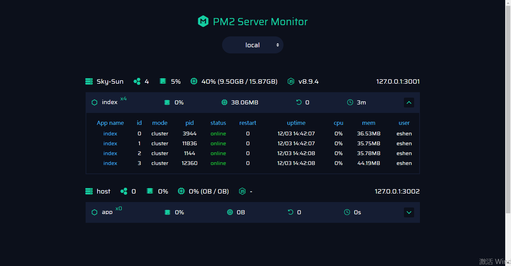

# server-monitor

O monitor para servidores pm2, com boa interface de usuário da web



## Uso

Instale o módulo de monitor com npm, em seu projeto:

```bash
> npm i --save pm2-server-monitor
```

Use o módulo no topo do código do seu projeto:

```js
const monitor = require('pm2-server-monitor');
monitor({
    // your server name, as a flag
    name: 'local',

    // your server listening port
    port: 3001
});
```
*Você pode ver o `./example` pasta para referência.*

Inicie seu servidor com PM2, não se esqueça do `--no-treekill` argumentO:

```bash
> pm2 start bin/www -i max --no-treekill
```

Adicione as informações dos servidores em `./webUI/config.js` arquivo:

```js
const servers = {
    'local': [{
        ip: '127.0.0.1',
        port: 3001,
        show: false
    }]
}
```

Abra `./webUI/index.html` para ver a IU do monitor.

**Nota:** você pode colocar a pasta `./WebUI` em qualquer lugar, ela tem zero dependências.

